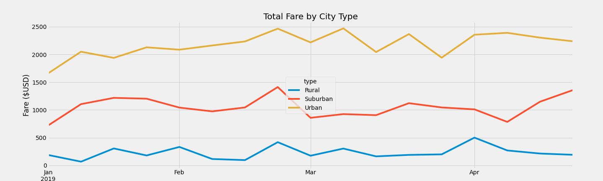

# PyBer_Analysis
###Overview:
PyBer is a ride-sharing company that is looking for a breakdown of rides, drivers, and fares by city type (Rural, Suburban, and Urban). Below you will see an analysis of this data and a chart outlining the Total Fares by City Type from January 2019 through April 2019.  

## Results
### Data Summary
For the Rural city type, in comparision to the Surburban and Urban city types, the Average Fare per Ride and Average Fare per Driver is the highest. The Average Fare per Ride for Rural cities can be contributed the Total Fares being split across only 125 Rides, both data points being on the lowest end of the city type spectrum. This also explains the Average Fare per Driver being the highest given that the Total Fares is divided by only 78 Drivers. It is safe to assume that the Average Fare per Ride is higher can be attributed to farther distances traveled amongst Total Rides given the higher dollar amount. 
In opposition to Rural, Urban city types have the lowest Average Fare per Ride and Average Fare per Driver. Based upon the number of Drivers being almost double the Total number of Rides we can see that the Average Fare per Drive is significantly lower than the other city types. From this data we can assume that a higher Total of Rides are taken in an Urban setting will be a shorter distance, giving the Average Fare per Ride a lower value. Overall the Total Fares produced by Urban rides beats out both Rural and Suburban Rides.     

### Total Fares by City Type
Below you will find a graph depicting the Total Fare by City Type from January 2019 through April 2019. 
This graph, while showing the overall differences between the city types as described above, also shows some exciting similarities. You can see during the last week of February all city types showed an increase in Total Fares. We do not see a similar universal spike across all city types for the remainder of the date frame however all city types have a slight upward trajectory from the begining of the year. 

## Summary
Based upon the above results, business recommendations are as follows:
1) Spend additional marketing and recruitment for the Rural and Suburban Drivers. Although this could bring down the Average Fare per Driver this may help to increase the Total Rides which may help to incrase Total Fares.
2) Give incentives for Urban Drivers to go to Rural and Suburban cities. 
3) Further analyze dates around universal and reoccuring Total Fare spikes to capitalize on costs and increase the number of Drivers if necessary. 
